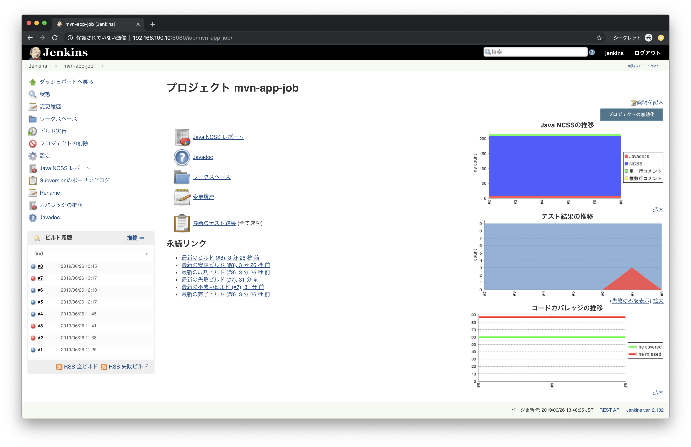
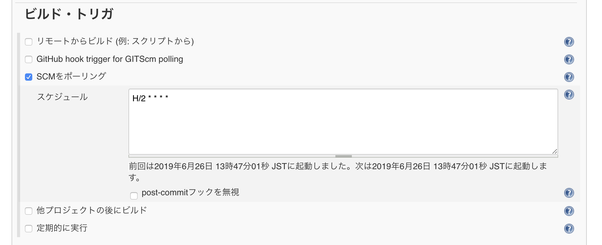
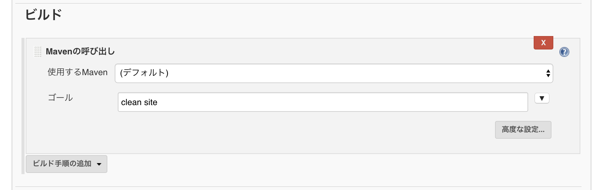
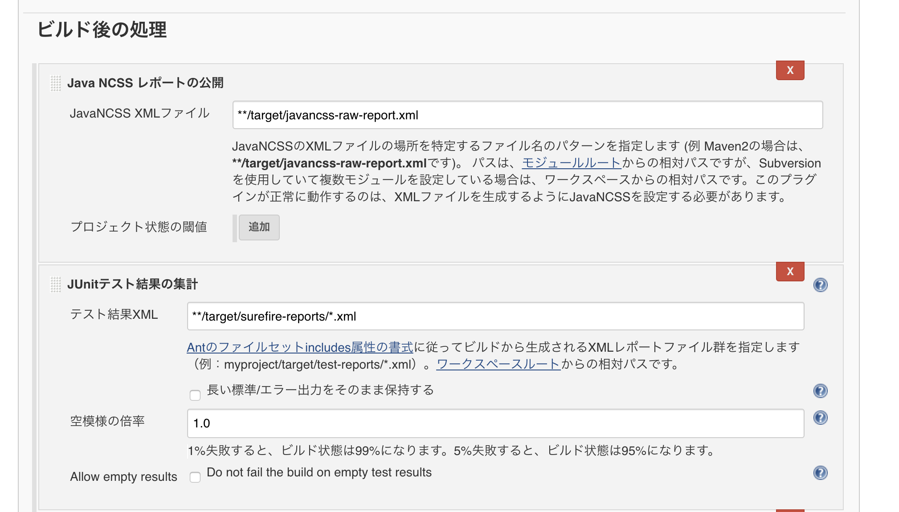
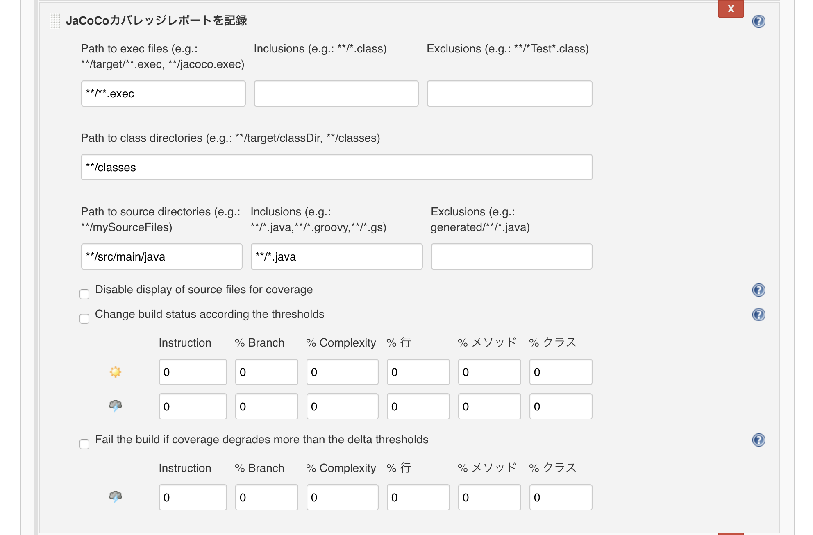
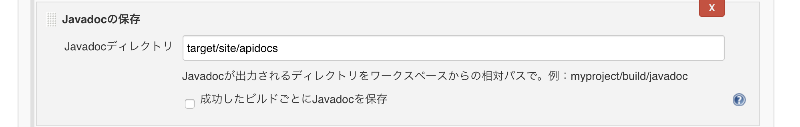

# Maven Pluginについて

## 1. サンプルアプリケーションのセットアップ

### サンプルアプリケーション概要

商品情報を検索するWebアプリです。TomcatなどのAPサーバ上で起動すると次のようなURLでアクセスできます。

```
http://localhost:8080/mvn-app/item
```

### データベース

MySQLかPostgreSQLなど

> データベース名はmvnappとします。

```sql
create table items(id integer primary key, name varchar(50), price integer, category integer);

insert into items values(1, 'ShoesA', 5000, 1);
insert into items values(2, 'ShoesB', 10000, 1);
insert into items values(3, 'ShoesC', 15000, 1);
insert into items values(4, 'BootsA', 10000, 2);
insert into items values(5, 'BootsB', 20000, 2);
insert into items values(6, 'BootsC', 30000, 2);
insert into items values(7, 'SandalsA', 1000, 3);
insert into items values(8, 'SandalsB', 2000, 3);
insert into items values(9, 'SandalsC', 3000, 3);
```

JDBCの接続設定は/src/main/resources/com/example/utils/db.propertiesで管理してます。

### 動作確認

Mavenの自動テストを実行します。

```
mvn test
```


### 補足：Eclipseプロジェクトにするには

```
mvn eclipse:eclipse
```


## 2. Mavenプラグイン

Mavenはプラグインアーキテクチャを採用しています。そのため、必要な機能をプラグインという形で追加することができます。

具体的には次のようなプラグインがあります。

+ maven-archetype-plugin
+ maven-eclipse-plugin
+ jetty-maven-plugin


> [Mavenプラグインの一覧](http://maven.apache.org/plugins/index.html)


Mavenのプラグインは大きく2つのタイプに分かれます。

+ Buildプラグイン
  + ビルド時に実行される
+ Reportプラグイン
  + mvn site時に実行される

Buildプラグインはpom.xmlのbuildタグの中に、Reportプラグインはreportタグの中にそれぞれ記述します。

### プラグイン（ゴール）の実行

Mavenプラグインはいくつかのゴールを持っています。これらのゴールはMavenのフェーズに関連しており、mvn testなどのコマンド実行時に自動的に実行されます。

上記のフェーズによる実行とは別に、プラグインのゴールを個別で実行することもできます。実行形式は次のようになります。

```
mvn PLUGINNAME:GOAL
```

たとえばMavenプロジェクトを作成する際には次のコマンドを実行します。

```
mvn archetype:generate
```

これはarchetypeプラグインのgenerateゴールを実行します。

> Mavenにはデフォルトで利用可能なプラグインが存在します。archetypeプラグイン（正式にはmaven-archetype-plugin）もその1つです。

## 3. Buildプラグイン

### jetty-maven-plugin

jetty-maven-pluginはJettyサーバを操作するプラグインです。

> [Jetty](http://www.eclipse.org/jetty/)とはオープンソースのAPサーバです。

pom.xmlの build > pluginsタグに以下の定義を追記します。

```xml
<plugin>
  <groupId>org.eclipse.jetty</groupId>
  <artifactId>jetty-maven-plugin</artifactId>
  <version>9.3.0.RC1</version>
  <configuration>
    <webApp>
      <contextPath>/mvn-app</contextPath>
    </webApp>
  </configuration>
</plugin>
```

pom.xmlを編集したらコンソールから次のコマンドを実行します。

```
mvn jetty:run
```

ブラウザから次のURLにアクセスしてみましょう

```
http://localhost:8080/mvn-app/item
```


## 4. Reportプラグイン

### javancss-maven-plugin

JavaNCSSはコードメトリクスを収集するライブラリです。

pom.xmlの reporting > pluginsタグに以下の定義を追記します。

```xml
<plugin>
  <groupId>org.codehaus.mojo</groupId>
  <artifactId>javancss-maven-plugin</artifactId>
  <version>2.1</version>
</plugin>
```

> javancss-maven-pluginはpom.xmlに定義済みです。

mvn siteコマンドを実行して、プロジェクト情報サイトを確認してみましょう。


### maven-surefire-report-plugin

surefireはJUnitなどで仕様するライブラリです。テスト結果を収集することができます。

```xml
<plugin>
  <groupId>org.apache.maven.plugins</groupId>
  <artifactId>maven-surefire-report-plugin</artifactId>
  <version>2.22.2</version>
</plugin>
```

### maven-javadoc-plugin

Javadocをレポートに含むこともできます。

```xml
<plugin>
  <groupId>org.apache.maven.plugins</groupId>
  <artifactId>maven-javadoc-plugin</artifactId>
  <version>3.1.0</version>
</plugin>
```

### jacoco-maven-plugin

テストカバレッジを記録します。

> buildプラグイン、reportingプラグインにそれぞれ記述します。

#### &lt;build&gt;

```xml
<plugin>
  <groupId>org.jacoco</groupId>
  <artifactId>jacoco-maven-plugin</artifactId>
  <version>0.8.4</version>
  <executions>
    <execution>
      <goals>
        <goal>prepare-agent</goal>
      </goals>
    </execution>
    <execution>
      <id>report</id>
      <phase>test</phase>
      <goals>
        <goal>report</goal>
      </goals>
    </execution>
  </executions>  
</plugin>
```

#### &lt;reporting&gt;

```xml
<plugin>
   <groupId>org.jacoco</groupId>
   <artifactId>jacoco-maven-plugin</artifactId>
   <version>0.8.4</version>
   <reportSets>
     <reportSet>
       <reports>
         <report>report</report>
       </reports>
     </reportSet>
   </reportSets>
 </plugin>
```

<!--
### cobertura-maven-plugin

coberturaはテストカバレッジを計測するライブラリです。

```
<plugin>
  <groupId>org.codehaus.mojo</groupId>
  <artifactId>cobertura-maven-plugin</artifactId>
  <version>2.7</version>
  <configuration>
    <formats>
        <format>html</format>
        <format>xml</format>
    </formats>
  </configuration>
</plugin>
```
-->

---

## Jenkins

JenkinsでCIします。




### プラグインの追加

Jenkinsの管理/プラグインの管理から、以下のプラグインを追加します。

+ JavaNCSS
+ JaCoCo
+ Javadoc

### ジョブの作成

任意のジョブ名を入力しフリースタイルプロジェクトのビルドを選択してジョブを作成します。

+ ソースコードの管理


> Credintialsには追加ボタンから、リポジトリのアカウントを指定します。

+ ビルド・トリガ



> `H/2 * * * *`

+ ビルド



> `clean site`


+ ビルド後の処理
  + JavaNCSSレポートの公開
  + JUnitテスト結果の集計
  + JaCoCoカバレッジレポートを記録
  + Javadocの保存



> `**/target/javancss-raw-report.xml`

> `**/target/surefire-reports/*.xml`



> デフォルトでOK



> `target/site/apidocs`

